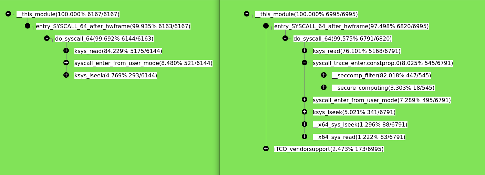

# A simple profiler
Fit for lightwight usage, minimum dependency

## Build
```
g++ -o profiler profiler.cpp
```

## Run
The profiler would open perf event with the cgroup which controls the specified pid
```
./profiler <pid>
```

To create a perf-event cgroup

cgroup v1
```
mkdir /sys/fs/cgroup/perf_event/<somename>
echo $$ > /sys/fs/cgroup/perf_event/<somename>/cgroup.procs
# run the target progrom
# run profiler with any pid within the cgroup
```
For cgroup v2, just use /sys/fs/cgroup/<somename>


## Example
When profiler terminated, a report is generated, following is an example showing the performance impact from seccomp when running a high-IO program within a docker container.

